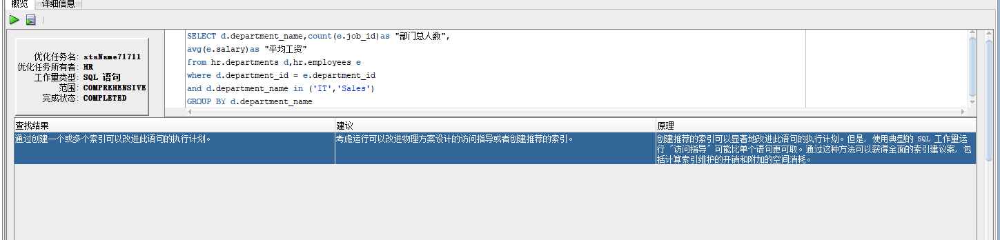
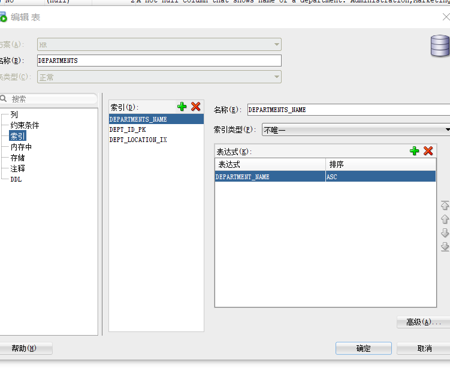

# Test1
第一种方式：

    SELECT d.department_name,count(e.job_id)as "部门总人数",
    avg(e.salary)as "平均工资"
    from hr.departments d,hr.employees e
    where d.department_id = e.department_id
    and d.department_name in ('IT','Sales')
    GROUP BY d.department_name;

第二种方式：

    SELECT d.department_name,count(e.job_id)as "部门总人数",
    avg(e.salary)as "平均工资"
    FROM hr.departments d,hr.employees e
    WHERE d.department_id = e.department_id
    GROUP BY d.department_name
    HAVING d.department_name in ('IT','Sales');

第一种和第二种方式中，我认为更优的是第一种。
使用优化工具，查看的优化建议是添加索引。
优化建议：

添加索引：

---
实验编写的SQL语句：

    SELECT d.department_name,count(e.job_id)as "部门总人数",
    avg(e.salary)as "平均工资"
    FROM hr.departments d INNER JOIN hr.employees e
    ON d.department_id = e.department_id
    and d.department_name in ('IT','Sales')
    GROUP BY d.department_name;

分析：通过显示连接（inner join）将两张表连接起来，减少在查询过程中的结果集，以达到提高效率的作用。