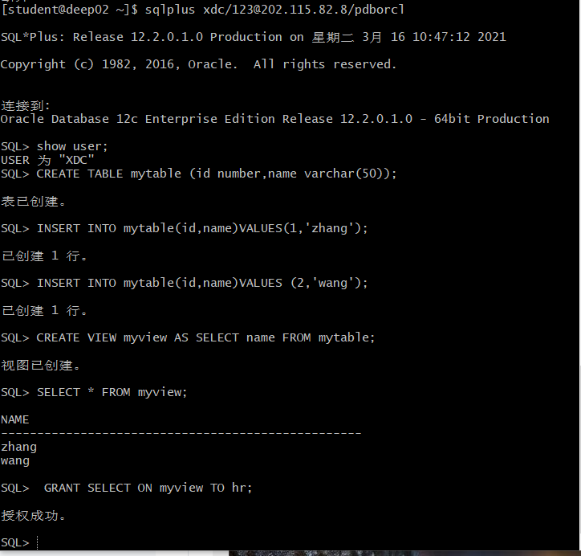

 # Test2

 ## 201810414323 夏德成 数据库名字：xdc
 ---
 ## 实验目的

+ 掌握用户管理、角色管理、权根维护与分配的能力。
+ 握用户之间共享对象的操作技能。
---

## 实验内容
Oracle有一个开发者角色resource，可以创建表、过程、触发器等对象，但是不能创建视图。
本训练要求：

+ 在pdborcl插接式数据中创建一个新的本地角色con_res_view，该角色包含connect和resource角色，同时也包含CREATE VIEW权限，这样任何拥有con_res_view的用户就同时拥有这三种权限。
+ 创建角色之后，再创建用户new_user，给用户分配表空间，设置限额为50M，授予con_res_view角色。
+ 最后测试：用新用户new_user连接数据库、创建表，插入数据，创建视图，查询表和视图的数据。

对于以下的对象名称con_res_view，new_user，在实验的时候应该修改为自己的名称。

## 实验步骤
### 第1步：
以system登录到pdborcl，创建角色con_res_view_xdc和用户xdc，并授权和分配空间：

    $ sqlplus system/123@202.115.82.8/pdborcl
    SQL> CREATE ROLE con_res_view_xdc;
    角色已创建。
    SQL> GRANT connect,resource,CREATE VIEW TO con_res_view_xdc;
    授权成功。
    SQL>  CREATE USER xdc IDENTIFIED BY 123 DEFAULT TABLESPACE users TEMPORARY TABLESPACE temp;
    用户已创建。
    SQL> ALTER USER xdc QUOTA 50M ON users;
    用户已更改。
    SQL> GRANT con_res_view_xdc TO xdc;
    授权成功。
    SQL> exit

### 第2步：
新用户xdc连接到pdborcl，创建表mytable和视图myview，插入数据，最后将myview的SELECT对象权限授予hr用户。

    $ sqlplus xdc/123@202.115.82.8/pdborcl
    SQL> show user;
    USER 为 "XDC"
    SQL> CREATE TABLE mytable (id number,name varchar(50));
    表已创建。
    SQL> INSERT INTO mytable(id,name)VALUES(1,'zhang');
    已创建 1 行。
    SQL> INSERT INTO mytable(id,name)VALUES (2,'wang');
    已创建 1 行。
    SQL> CREATE VIEW myview AS SELECT name FROM mytable;
    视图已创建。
    SQL> SELECT * FROM myview;
    NAME
    --------------------------------------------------
    zhang
    wang
    SQL>  GRANT SELECT ON myview TO hr;
    授权成功。
    SQL> exit

### 第3步：
用户hr连接到pdborcl，查询xdc授予它的视图myview

    $ sqlplus hr/123@202.115.82.8/pdborcl
    SQL> SELECT * FROM xdc.myview;
    NAME
    --------------------------------------------------
    zhang
    wang

## 查看数据库的使用情况
查看表空间的数据库文件，以及每个文件的磁盘占用情况。

    $ sqlplus system/123@202.115.82.8/pdborcl
    SQL> SELECT tablespace_name,FILE_NAME,BYTES/1024/1024 MB,MAXBYTES/1024/1024 MAX_MB,autoextensible FROM dba_data_files  WHERE  tablespace_name='USERS';

    TABLESPACE_NAME
    ------------------------------
    FILE_NAME
    --------------------------------------------------------------------------------
            MB     MAX_MB AUT
    ---------- ---------- ---
    USERS
    /home/oracle/app/oracle/oradata/orcl/pdborcl/users01.dbf
            5 32767.9844 YES

    SELECT a.tablespace_name "表空间名",Total/1024/1024 "大小MB",
    free/1024/1024 "剩余MB",( total - free )/1024/1024 "使用MB",
    Round(( total - free )/ total,4)* 100 "使用率%"
    4   from (SELECT tablespace_name,Sum(bytes)free
            FROM   dba_free_space group  BY tablespace_name)a,
    6         (SELECT tablespace_name,Sum(bytes)total FROM dba_data_files
            group  BY tablespace_name)b
    8   where  a.tablespace_name = b.tablespace_name;

    表空间名                           大小MB     剩余MB     使用MB    使用率%
    ------------------------------ ---------- ---------- ---------- ----------
    SYSAUX                                590    30.1875   559.8125      94.88
    UNDOTBS1                              100       27.5       72.5       72.5
    USERS                                   5     3.1875     1.8125      36.25
    SYSTEM                                270        9.5      260.5      96.48

+ autoextensible是显示表空间中的数据文件是否自动增加。
+ MAX_MB是指数据文件的最大容量。

