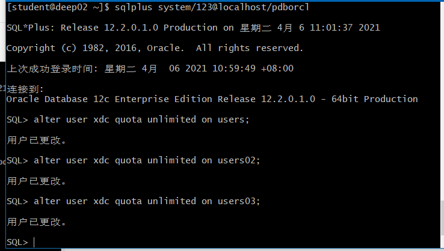
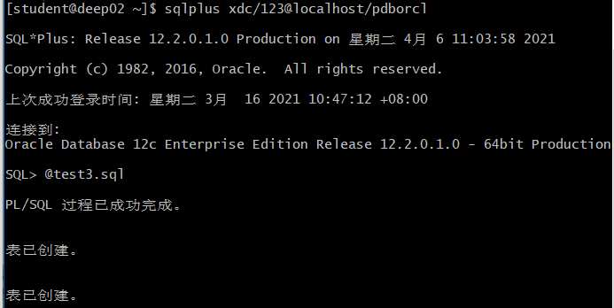
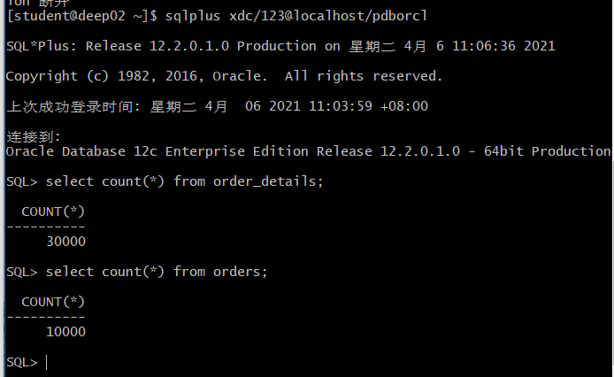
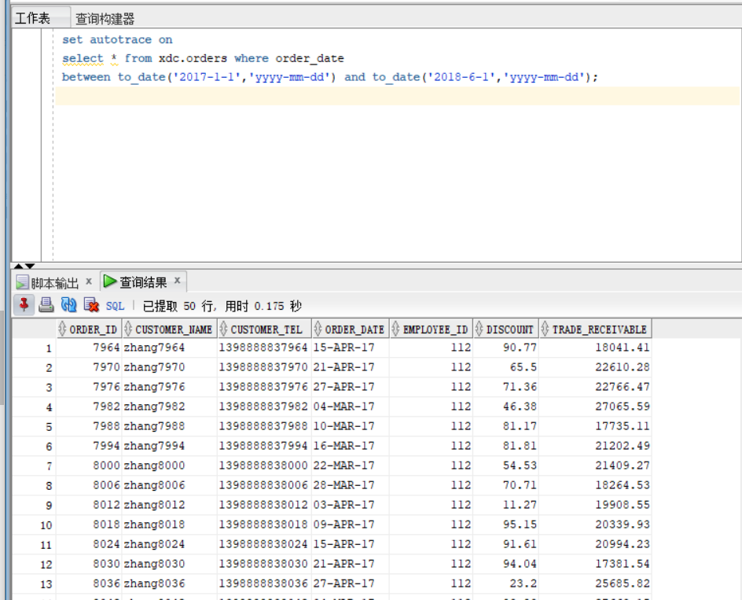
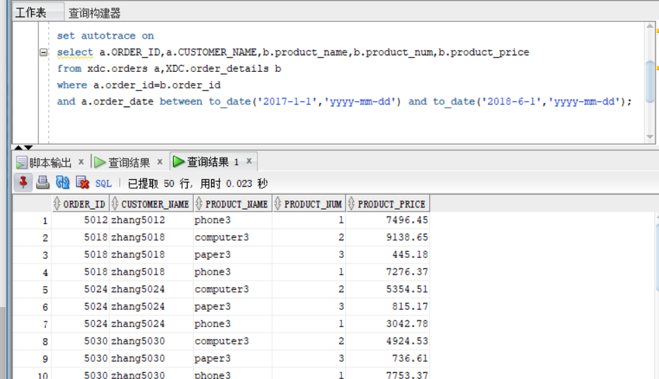
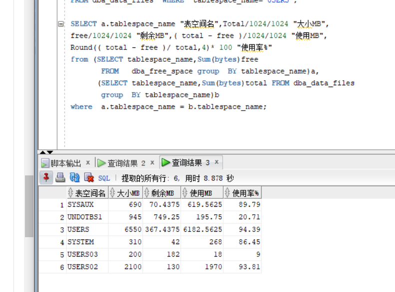
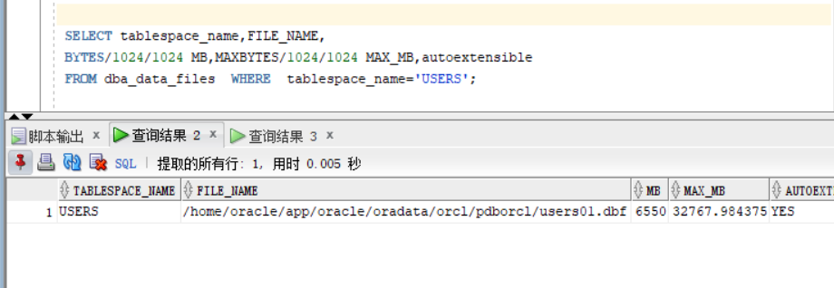

# 实验3：创建分区表
## 实验目的
掌握分区表的创建方法，掌握各种分区方式的使用场景。

## 实验内容
- 本实验使用3个表空间：USERS,USERS02,USERS03。在表空间中创建两张表：订单表(orders)与订单详表(order_details)。
- 使用你自己的账号创建本实验的表，表创建在上述3个分区，自定义分区策略。
- 你需要使用system用户给你自己的账号分配上述分区的使用权限。你需要使用system用户给你的用户分配可以查询执行计划的权限。
- 表创建成功后，插入数据，数据能并平均分布到各个分区。每个表的数据都应该大于1万行，对表进行联合查询。
- 写出插入数据的语句和查询数据的语句，并分析语句的执行计划。
进行分区与不分区的对比实验。
## 实验步骤
### 1.更改用户状态

 ### 2.登录xdc,运行test3.sql
 
 ### 3.运行结果查看
  
 ### 4.以system用户运行，简单查询和联表查询
 - 简单查询
  
  - 联表查询
  
  ### 5.查看表空间和数据库文件及其磁盘占用情况
  
  
  ## 总结体会
  通过这次实验，学习了解到Oracle中如何对表分区，以及如何设计分区。
在Oracle数据库中，如果表的大小超过2GB，并且表中包含历史数据，新的数据背增加到新的分区中是需要用到分区表的。