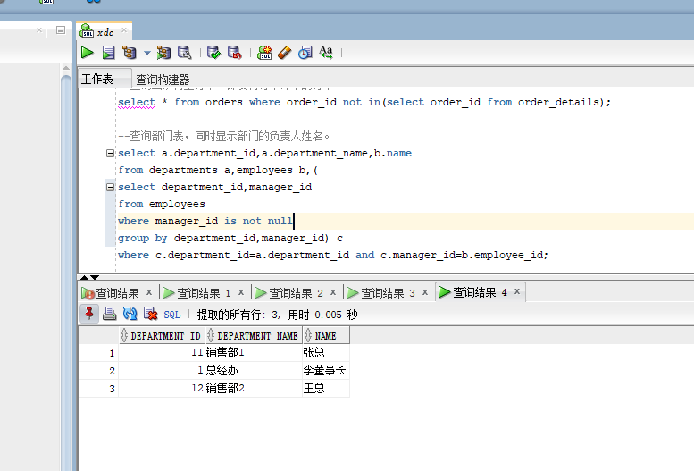

# 实验4：对象管理

## 201810414323 夏德成 数据库名字：xdc


--- 
## 实验目的：
了解Oracle表和视图的概念，学习使用SQL语句Create Table创建表，学习Select语句插入，修改，删除以及查询数据，学习使用SQL语句创建视图，学习部分存储过程和触发器的使用。
## 实验场景：
假设有一个生产某个产品的单位，单位接受网上订单进行产品的销售。通过实验模拟这个单位的部分信息：员工表，部门表，订单表，订单详单表。
## 实验内容：
- 录入数据：要求至少有1万个订单，每个订单至少有4个详单。至少有两个部门，每个部门至少有1个员工，其中只有一个人没有领导，一个领导至少有一个下属，并且它的下属是另一个人的领导（比如A领导B，B领导C）。

- 序列的应用:插入ORDERS和ORDER_DETAILS 两个表的数据时，主键ORDERS.ORDER_ID, ORDER_DETAILS.ID的值必须通过序列SEQ_ORDER_ID和SEQ_ORDER_ID取得，不能手工输入一个数字。

- 触发器的应用：维护ORDER_DETAILS的数据时（insert,delete,update）要同步更新ORDERS表订单应收货款ORDERS.Trade_Receivable的值。

### 结果查询：
- 查询某个员工的信息

- 递归查询某个员工及其所有下属，子下属员工。

- 查询订单表，并且包括订单的订单应收货款: Trade_Receivable= sum(订单详单表.roductNum*订单详单表.ProductPrice)- Discount。

- 查询订单详表，要求显示订单的客户名称和客户电话，产品类型用汉字描述。

- 查询出所有空订单，即没有订单详单的订单。

- 查询部门表，同时显示部门的负责人姓名。

- 查询部门表，统计每个部门的销售总金额。


## 实验总结：

在本次的实验中，我学习了Oracle表和视图的概念，学习使用SQL语句创建视图，学习部分存储过程和触发器的使用。在实验的过程中遇到一些问题，但跟着老师的代码敲还是没得问题的，就是步骤有点多。

## 实验过程sql语句

```select * from orders;
select * from order_details;
select * from employees;
--- 查询某个员工的信息
select * from employees where name='李董事长';

--递归查询某个员工及其所有下属，子下属员工。(查询李董事长以及下属员工)
select * 
from employees 
start with  employee_id 
in (select department_id from employees where name ='李董事长') 
CONNECT by PRIOR employee_id=manager_id;

--查询订单表，并且包括订单的订单应收货款: Trade_Receivable= sum(订单详单表.roductNum*订单详单表.ProductPrice)- Discount。
select o.order_id,customer_name,customer_tel,order_date,employee_id,discount,trade_receivable,d.product_Num*d.Product_price as 应收货款
from orders o,ORDER_DETAILS d
where o.order_id=d.order_id; 

--查询订单详表，要求显示订单的客户名称和客户电话，产品类型用汉字描述。
select d.id,d.order_id,o.customer_name 客户名称,o.customer_tel 客户电话,d.product_name 产品类型, d.product_price
from order_details d,orders o
where o.order_id=d.order_id

--查询出所有空订单，即没有订单详单的订单。
select * from orders where order_id not in(select order_id from order_details);

--查询部门表，同时显示部门的负责人姓名。
select a.department_id,a.department_name,b.name
from departments a,employees b,(
select department_id,manager_id
from employees
where manager_id is not null
group by department_id,manager_id) c
where c.department_id=a.department_id and c.manager_id=b.employee_id;

--查询部门表，统计每个部门的销售总金额。
select department_id,department_name,sum(trade_receivable)from
(select a.department_id,d.department_name,trade_receivable
from employees a,orders b,departments d
where b.employee_id=a.employee_id and d.department_id=a.department_id
group by a.department_id,d.department_name,b.trade_receivable) c
group by department_id,department_name;