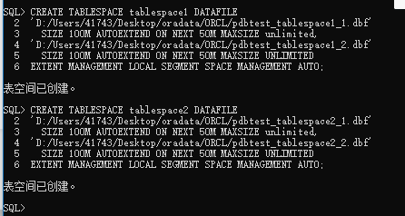

# Test6 图书管理系统Oralce数据库设计
## 201810414323 夏德成 18级软件工程3班

##  期末考核要求

* 设计项目涉及的表及表空间使用方案。至少5张表和5万条数据，两个表空间。
* 设计权限及用户分配方案。至少两类角色，两个用户。
* 在数据库中建立一个程序包，在包中用PL/SQL语言设计一些存储过程和函数，实现比较复杂的业务逻辑，用模拟数据进行执行计划分析。
* 设计自动备份方案或则手工备份方案。

## 一：搭建本地Oracle环境后，登录Oracle并设置密码

```plain
//进入cmd命令窗口，不使用用户名和密码登录
sqlplus/nolog   
sqlplus/ as sysdba
//更改system用户的密码
alter user system identified by system;
//测试登录
sqlplus
//输入用户system和密码system->登录成功
```
## 二：创建两类角色和两个用户

### 1.创建两类角色

```sql
--1角色
--创建 C##XDC_Role1 角色
CREATE ROLE C##XDC_Role1;
--给C##XDC_Role1授权
GRANT connect,resource,CREATE VIEW TO C##XDC_Role1;
--2角色
--创建 C##XDC_Role2 角色
CREATE ROLE C##XDC_Role2;
--给C##XDC_Role2授权
GRANT connect,resource,CREATE VIEW TO C##XDC_Role2;
```
### 2.创建两个用户

```sql
--1用户
--创建用户C##XDC_user1
CREATE USER C##XDC_user1 IDENTIFIED BY zytzyt1 DEFAULT TABLESPACE users TEMPORARY TABLESPACE temp;
--指授权C##XDC_user用户访问users表空间，空间限额是50M。
ALTER USER C##XDC_user1 QUOTA 50M ON users;
--指定用户的角色
GRANT C##XDC_Role1 TO C##XDC_user1;
--2用户
--创建用户C##XDC_user2
CREATE USER C##XDC_user2 IDENTIFIED BY zytzyt2 DEFAULT TABLESPACE users TEMPORARY TABLESPACE temp;
```
### 3.给用户赋予角色和指定表空间限额

```sql
--指授权C##XDC_user用户访问users表空间，空间限额是50M。
ALTER USER C##XDC_user2 QUOTA 50M ON users;
--指定用户的角色
GRANT C##XDC_Role2 TO C##XDC_user2;
```
运行结果：
```cmd
SQL> CREATE ROLE C##XDC_Role1;
角色已创建。
SQL> GRANT connect,resource,CREATE VIEW TO C##XDC_Role1;
授权成功。
SQL> CREATE ROLE C##XDC_Role2;
角色已创建。
SQL> GRANT connect,resource,CREATE VIEW TO C##XDC_Role2;
授权成功。
SQL> CREATE USER C##XDC_user1 IDENTIFIED BY zytzyt1 DEFAULT TABLESPACE users TEMPORARY TABLESPACE temp;
用户已创建。
SQL> ALTER USER C##XDC_user1 QUOTA 50M ON users;
用户已更改。
SQL> GRANT C##XDC_Role1 TO C##XDC_user1;
授权成功。
SQL> CREATE USER C##XDC_user2 IDENTIFIED BY zytzyt2 DEFAULT TABLESPACE users TEMPORARY TABLESPACE temp;
用户已创建。
SQL> ALTER USER C##XDC_user2 QUOTA 50M ON users;
用户已更改。
SQL> GRANT C##XDC_Role2 TO C##XDC_user2;
授权成功。
```

## 三：创建表空间并授权给用户

### 1.创建表空间

```sql
--查看表空间
 select * from v$tablespace;
 
-- 创建表空间1
CREATE TABLESPACE tablespace1 DATAFILE
'D:/Users/41743/Desktop/oradata/ORCL/pdbtest_tablespace1_1.dbf'
  SIZE 100M AUTOEXTEND ON NEXT 50M MAXSIZE unlimited,
'D:/Users/41743/Desktop/oradata/ORCL/pdbtest_tablespace1_2.dbf' 
  SIZE 100M AUTOEXTEND ON NEXT 50M MAXSIZE UNLIMITED
EXTENT MANAGEMENT LOCAL SEGMENT SPACE MANAGEMENT AUTO;
-- 创建表空间2
CREATE TABLESPACE tablespace2 DATAFILE
'D:/Users/41743/Desktop/oradata/ORCL/pdbtest_tablespace2_1.dbf'
  SIZE 100M AUTOEXTEND ON NEXT 50M MAXSIZE unlimited,
'D:/Users/41743/Desktop/oradata/ORCL/pdbtest_tablespace2_2.dbf'
  SIZE 100M AUTOEXTEND ON NEXT 50M MAXSIZE UNLIMITED
EXTENT MANAGEMENT LOCAL SEGMENT SPACE MANAGEMENT AUTO;
```
运行结果：
```sql
SQL> CREATE TABLESPACE tablespace1 DATAFILE
  2  'D:/Users/41743/Desktop/oradata/ORCL/pdbtest_tablespace1_1.dbf'
  3    SIZE 100M AUTOEXTEND ON NEXT 50M MAXSIZE unlimited,
  4  'D:/Users/41743/Desktop/oradata/ORCL/pdbtest_tablespace1_2.dbf'
  5    SIZE 100M AUTOEXTEND ON NEXT 50M MAXSIZE UNLIMITED
  6  EXTENT MANAGEMENT LOCAL SEGMENT SPACE MANAGEMENT AUTO;
表空间已创建。
SQL> CREATE TABLESPACE tablespace2 DATAFILE
  2  'D:/Users/41743/Desktop/oradata/ORCL/pdbtest_tablespace2_1.dbf'
  3    SIZE 100M AUTOEXTEND ON NEXT 50M MAXSIZE unlimited,
  4  'D:/Users/41743/Desktop/oradata/ORCL/pdbtest_tablespace2_2.dbf'
  5    SIZE 100M AUTOEXTEND ON NEXT 50M MAXSIZE UNLIMITED
  6  EXTENT MANAGEMENT LOCAL SEGMENT SPACE MANAGEMENT AUTO;
表空间已创建。
```



### 2.登录账号并授予权限

```sql
--首先创建自己的账号your_user，然后以system身份登录:
ALTER USER C##XDC_user1 QUOTA UNLIMITED ON USERS;
ALTER USER C##XDC_user1 QUOTA UNLIMITED ON tablespace1;
ALTER USER C##XDC_user1 QUOTA UNLIMITED ON tablespace2;
```
运行结果：
```sql
SQL> ALTER USER C##XDC_user1 QUOTA UNLIMITED ON USERS;
用户已更改。
SQL> ALTER USER C##XDC_user1 QUOTA UNLIMITED ON tablespace1;
用户已更改
SQL> ALTER USER C##XDC_user1 QUOTA UNLIMITED ON tablespace2;
用户已更改。
```
截图：


## 四：创建数据表

### 数据表分析：

1.用户表

| 字段          | 类型               | 是否为空 | 主/外键 | 默认值 | 约束 |
| ------------- | ------------------ | -------- | ------- | ------ | ---- |
| user_id       | number(20)         | 否       | 主键    |        |      |
| user_name     | VARCHAR2(100 BYTE) | 否       |         |        |      |
| user_password | VARCHAR2(100 BYTE) | 否       |         |        |      |

2.书种类表

| 字段         | 类型               | 是否为空 | 主/外键 | 默认值 | 约束 |
| ------------ | ------------------ | -------- | ------- | ------ | ---- |
| type_id      | number(20)         | 否       | 主键    |        |      |
| type_name    | VARCHAR2(100 BYTE) | 否       |         |        |      |
| type_comment | VARCHAR2(100 BYTE) | 否       |         |        |      |

3.出版社表

| 字段      | 类型               | 是否为空 | 主/外键 | 默认值 | 约束 |
| --------- | ------------------ | -------- | ------- | ------ | ---- |
| PUB_id    | number(20)         | 否       | 主键    |        |      |
| PUB_name  | VARCHAR2(100 BYTE) | 否       |         |        |      |
| PUB_tel   | VARCHAR2(100 BYTE) | 否       |         |        |      |
| PUB_intro | VARCHAR2(100 BYTE) | 否       |         |        |      |

4.书籍表

| 字段                | 类型               | 是否为空 | 主/外键 | 默认值 | 约束 |
| ------------------- | ------------------ | -------- | ------- | ------ | ---- |
| book_id             | number(20)         | 否       | 主键    |        |      |
| book_name           | VARCHAR2(100 BYTE) | 否       |         |        |      |
| book_info           | VARCHAR2(100 BYTE) | 否       |         |        |      |
| book_price          | VARCHAR2(100 BYTE) | 否       |         |        |      |
| TYPE_ID_FK          | number(20,2)       | 否       | 外键    |        |      |
| PUB_ID_FK           | number(20)         | 否       | 外键    |        |      |
| book_IMAGE_URL      | number(20)         | 否       |         |        |      |
| book_AUTHOR         | VARCHAR2(100 BYTE) | 否       |         |        |      |
| book_REPERTORY_SIZE | int                | 否       |         |        |      |

5.交易记录表

| 字段        | 类型 | 是否为空 | 主/外键 | 默认值 | 约束 |
| ----------- | ---- | -------- | ------- | ------ | ---- |
| id          | int  | 否       | 主键    |        |      |
| RECORD_DATE | Date | 否       |         |        |      |

6.书的销售记录

| 字段                | 类型       | 是否为空 | 主/外键 | 默认值 | 约束 |
| ------------------- | ---------- | -------- | ------- | ------ | ---- |
| id                  | number(20) | 否       | 主键    |        |      |
| BOOK_ID_FK          | number(20) | 否       | 外键    |        |      |
| T_SALE_RECORD_ID_FK | int        | 否       | 外键    |        |      |
| TRADE_SUM           | int        | 否       |         |        |      |

7.入库记录表

| 字段        | 类型       | 是否为空 | 主/外键 | 默认值 | 约束 |
| ----------- | ---------- | -------- | ------- | ------ | ---- |
| id          | number(20) | 否       | 主键    |        |      |
| RECORD_DATE | Date       | 否       |         |        |      |

8.书的入库记录

| 字段              | 类型       | 是否为空 | 主/外键 | 默认值 | 约束 |
| ----------------- | ---------- | -------- | ------- | ------ | ---- |
| id                | number(20) | 否       | 主键    |        |      |
| BOOK_ID_FK        | number(20) | 否       | 外键    |        |      |
| T_IN_RECORD_ID_FK | number(20) | 否       | 外键    |        |      |
| IN_SUM            | int        | 否       |         |        |      |

### 1. 用户表

```sql
  create table T_USER
(
user_id  number(20) primary key,
user_name  VARCHAR2(100 BYTE) not null,
user_password VARCHAR2(100 BYTE) not null
)
tablespace tablespace1
pctfree 10 
initrans 1 
maxtrans 255 
storage 
(
initial 64K 
next 1M
minextents 1 
maxextents unlimited 
);
```
### 2.书种类表：

```sql
create table T_BOOK_TYPE
(
type_id  number(20) primary key,
type_name VARCHAR2(100 BYTE) not null,                       
type_comment VARCHAR2(100 BYTE)
)
tablespace tablespace1
pctfree 10 
initrans 1 
maxtrans 255 
storage                           
(
initial 64K 
next 1M
minextents 1 
maxextents unlimited 
);
```

### 3.出版社表：

```sql
create table T_PUBLISHER
(
PUB_id  number(20) primary key,
PUB_name VARCHAR2(100 BYTE) not null,
PUB_tel VARCHAR2(100 BYTE) not null,
PUB_intro VARCHAR2(100 BYTE) not null
)
tablespace tablespace1
pctfree 10 
initrans 1 
maxtrans 255 
storage                           
(
initial 64K 
next 1M
minextents 1 
maxextents unlimited 
);
```

### 4.书籍表：

```sql
create table T_BOOK
(
book_id  number(20) primary key,
book_name VARCHAR2(100 BYTE) not null,
book_info VARCHAR2(100 BYTE) not null, 
book_price number(20,2) not null,  
TYPE_ID_FK number(20) not null,  
PUB_ID_FK number(20) not null,               
book_IMAGE_URL VARCHAR2(100 BYTE) not null,
book_AUTHOR VARCHAR2(100 BYTE) not null,
book_REPERTORY_SIZE int not null                        
)
tablespace tablespace2
pctfree 10 
initrans 1 
maxtrans 255 
storage                           
(
initial 64K 
next 1M
minextents 1 
maxextents unlimited 
);
```

### 5.交易记录表

```sql
create table T_SALE_RECORD
(
id  int primary key,
RECORD_DATE Date not null
)
tablespace tablespace2
pctfree 10 
initrans 1 
maxtrans 255 
storage                           
(
initial 64K 
next 1M
minextents 1 
maxextents unlimited 
);              
```

### 6.书的销售记录

```sql
create table T_BOOK_SALE_RECORD
(
id  number(20) not null ,
BOOK_ID_FK number(20) not null references T_BOOK(book_id),
T_SALE_RECORD_ID_FK int not null references T_SALE_RECORD(id),
TRADE_SUM int not null   
)
tablespace tablespace1
pctfree 10 
initrans 1 
maxtrans 255 
storage                           
(
initial 64K 
next 1M
minextents 1 
maxextents unlimited 
);                    
```

### 7.入库记录表

```sql
create table T_IN_RECORD
(
id  number(20) primary key,
RECORD_DATE Date not null
)
tablespace tablespace2
pctfree 10 
initrans 1 
maxtrans 255 
storage                           
(
initial 64K 
next 1M
minextents 1 
maxextents unlimited 
);   
```

### 8.书的入库记录

```sql
create table T_BOOK_IN_RECORD
(
id  number(20) primary key,
BOOK_ID_FK  number(20) not null references T_BOOK(book_id), 
T_IN_RECORD_ID_FK number(20) not null references T_IN_RECORD(id),
IN_SUM int not null    
)
tablespace tablespace2
pctfree 10 
initrans 1 
maxtrans 255 
storage                           
(
initial 64K 
next 1M
minextents 1 
maxextents unlimited 
);
```

### 查询表空间的数据库

```sql
select TABLE_NAME from dba_tables where TABLESPACE_NAME='TABLESPACE1';
select TABLE_NAME from dba_tables where TABLESPACE_NAME='TABLESPACE2';
```


## 五：向表中插入数据

### 1.模拟数据插入：

```plain
总共插入数据：52200条
T_USER：10000条
T_BOOK_TYPE：100条
T_PUBLISHER：100条
T_BOOK：20000条
T_SALE_RECORD：10000条
T_BOOK_SALE_RECORD：10000条
T_IN_RECORD：1000条
T_BOOK_IN_RECORD：1000条
```

### 2.T_USER表的数据插入10000条

```sql
declare 
i int;
user_id  number(20) ;
user_name  VARCHAR2(100 BYTE);
user_password VARCHAR2(100 BYTE);
begin
i:=1;
while i<=10000 
loop
user_id:=i;
user_name:= 'name'|| i;
user_password := '123'|| i;
insert into T_USER(user_id,user_name,user_password) values (user_id,user_name,user_password);
i:=i+1;
end loop;
commit;
end;
/
```

### 3.T_BOOK_TYPE表数据插入1000

```sql
declare 
i int;
type_id  number(20) ;
type_name VARCHAR2(100 BYTE) ;          
type_comment VARCHAR2(100 BYTE);
begin
i:=1;
while i<=1000
loop
type_id:=i;
type_name:= 'type'|| i;
type_comment := '介绍'||i;
insert into T_BOOK_TYPE(type_id,type_name,type_comment) values (type_id,type_name,type_comment);
i:=i+1;
end loop;
commit;
end;
/       
```

### 4.T_PUBLISHER表的数据插入100条

```sql
declare 
i int;
PUB_id  number(20);
PUB_name VARCHAR2(100 BYTE) ;
PUB_tel VARCHAR2(100 BYTE) ;
PUB_intro VARCHAR2(100 BYTE) ;
begin
i:=1;
while i<=100
loop
PUB_id  :=i;
PUB_name := 'name'|| i;
PUB_tel := '电话'|| i;
PUB_intro := '介绍'|| i;
insert into T_PUBLISHER(PUB_id  ,PUB_name ,PUB_tel ,PUB_intro ) values (PUB_id  ,PUB_name ,PUB_tel ,PUB_intro);
i:=i+1;
end loop;
commit;
end;
/
                     
```

### 5.T_BOOK表的数据插入20000条

```sql
declare 
i int;
book_id  number(20) ;
book_name VARCHAR2(100 BYTE);
book_info VARCHAR2(100 BYTE) ;
book_price number(20,2) ;
TYPE_ID_FK number(20);
PUB_ID_FK number(20) ;      
book_IMAGE_URL VARCHAR2(100 BYTE) ;
book_AUTHOR VARCHAR2(100 BYTE) ;
book_REPERTORY_SIZE int ;
begin
i:=1;
while i<=20000
loop
book_id:=i;
book_name := 'name'||i;
book_info := 'info'||i;
book_price :=dbms_random.value(100,1);
TYPE_ID_FK := i;
PUB_ID_FK := i;
book_IMAGE_URL:='Bnnnnn'||i;
book_AUTHOR:='Bnnnnn'||i;
book_REPERTORY_SIZE :=i;
insert into T_BOOK(book_id,book_name ,book_info ,book_price ,TYPE_ID_FK ,PUB_ID_FK ,book_IMAGE_URL,book_AUTHOR,book_REPERTORY_SIZE ) values (book_id,book_name ,book_info ,book_price ,TYPE_ID_FK ,PUB_ID_FK ,book_IMAGE_URL,book_AUTHOR,book_REPERTORY_SIZE);
i:=i+1;
end loop;
commit;
end;
/
                      
```

### 6.T_SALE_RECORD表的数据插入10000条

```sql
declare 
i int;
id  int;
RECORD_DATE Date ;
begin
i:=1;
while i<=10000 
loop
id  :=i;
if i mod 6 =0 then
  RECORD_DATE :=to_date('2015-3-2','yyyy-mm-dd')+(i mod 60);
elsif i mod 6 =1 then
  RECORD_DATE :=to_date('2016-3-2','yyyy-mm-dd')+(i mod 60);
elsif i mod 6 =2 then
  RECORD_DATE :=to_date('2017-3-2','yyyy-mm-dd')+(i mod 60);
elsif i mod 6 =3 then
  RECORD_DATE :=to_date('2018-3-2','yyyy-mm-dd')+(i mod 60);
elsif i mod 6 =4 then
  RECORD_DATE :=to_date('2019-3-2','yyyy-mm-dd')+(i mod 60);
else
  RECORD_DATE :=to_date('2020-3-2','yyyy-mm-dd')+(i mod 60);
end if;
insert into T_SALE_RECORD(id,RECORD_DATE) values (id,RECORD_DATE);
i:=i+1;
end loop;
commit;
end;
/         
```

### 7.T_IN_RECORD表的数据的插入10000条

```sql
declare 
i int;
id  number(20);
RECORD_DATE Date;
begin
i:=1;
while i<=10000 
loop
id:=i;
if i mod 6 =0 then
  RECORD_DATE :=to_date('2015-3-2','yyyy-mm-dd')+(i mod 60);
elsif i mod 6 =1 then
  RECORD_DATE :=to_date('2016-3-2','yyyy-mm-dd')+(i mod 60);
elsif i mod 6 =2 then
  RECORD_DATE :=to_date('2017-3-2','yyyy-mm-dd')+(i mod 60);
elsif i mod 6 =3 then
  RECORD_DATE :=to_date('2018-3-2','yyyy-mm-dd')+(i mod 60);
elsif i mod 6 =4 then
  RECORD_DATE :=to_date('2019-3-2','yyyy-mm-dd')+(i mod 60);
else
  RECORD_DATE :=to_date('2020-3-2','yyyy-mm-dd')+(i mod 60);
end if;
insert into T_IN_RECORD(id,RECORD_DATE) values (id,RECORD_DATE);
i:=i+1;
end loop;
end;
/
```

### 8.T_BOOK_IN_RECORD表的数据插入10000条

```sql
declare 
i int;
id number(20);
BOOK_ID_FK  number(20);
T_IN_RECORD_ID_FK number(20);
IN_SUM int;  
begin
i:=1;
while i<=10000 
loop
id:=i;
BOOK_ID_FK:=i;
T_IN_RECORD_ID_FK:=i;
 IN_SUM :=i;
insert into T_BOOK_IN_RECORD(id,BOOK_ID_FK,T_IN_RECORD_ID_FK,IN_SUM ) values (id,BOOK_ID_FK,T_IN_RECORD_ID_FK,IN_SUM);
i:=i+1;
end loop;
commit;
end;
/ 
```

### 9.查询是否插入成功

```sql
select count(*) from T_USER;
select count(*) from T_BOOK_TYPE;
select count(*) from T_PUBLISHER;
select count(*) from T_BOOK;
select count(*) from T_SALE_RECORD;
select count(*) from T_BOOK_SALE_RECORD;
select count(*) from T_IN_RECORD;
select count(*) from T_BOOK_IN_RECORD
```


## 六：创建程序包

```plain
包名：BookPack
函数名：Get_OutBook(id NUMBER)  功能： 输入销售记录编号，获取该次销售记录所关联的图书
过程名：Get_InBook(id  NUMBER)  功能: 输入入库记录编号，获取该次入库所关联的图书
```

``` sql
-- 创建包
create or replace PACKAGE BookPack IS
  FUNCTION Get_OutBook(id NUMBER);
  PROCEDURE Get_InBook(id NUMBER);
END TrainPack;
-- 创建函数和过程
create or replace PACKAGE BODY BookPack IS
    FUNCTION Get_OutBook(id NUMBER)
    AS
     M VARCHAR2(100);
     N VARCHAR2(100);
     BEGIN
       select * into N from T_BOOK_SALE_RECORD a,T_SALE_RECORD,T_book c b where a.id=b.id and a.BOOK_ID_FK=c.book_id; 
     END;
    PROCEDURE Get_orders(train_id_t VARCHAR2)
    AS
        N NUMBER(20);
        L date;
        S VARCHAR2(20);
        R VARCHAR2(100);
    begin
        select * into M from T_IN_RECORD a,T_BOOK_IN_RECORD b,T_book c b where a.id=b.id and a.BOOK_ID_FK=c.book_id;
    END;
END TrainPack;
/
```

## 六：设计手动备份方案

### 1.创建恢复目录

```sql
-- 创建恢复目录
create tablespace bp datafile 'D:/Users/41743/Desktop/oradata/ORCL/bp.dbf' size 20m autoextend on next 5m maxsize unlimited;
-- 在恢复目录数据库中创建RMAN用户并授权
create user c##_XDC_user1 identified by zytzyt1 default tablespace bp quota unlimited on bp;
grant connect,resource,recovery_catalog_owner to c##_XDC_user1;
```


### 2.连接RMAN恢复目录数据库

```sql
-- 连接RMAN恢复目录数据库
rman catalog c##_XDC_user1/zytzyt1
-- 创建恢复目录
create catalog tablespace bp;
-- 退出
quit
-- 确认环境信息
echo $ORACLE_SID
-- 连接到目标数据库、连接到恢复目录数据库
rman catalog c##_XDC_user1/zytzyt1 target /
-- 向恢复目录注册数据库ORCL——此时就可以使用RMAN的恢复目录对目标数据库进行备份和恢复操作
register database;
```


### 3.通道分配

```sql
-- 手动通道配置
run
{
allocate channel ch1 device type disk;
allocate channel ch2 device type disk;
allocate channel ch3 device type disk;
}
-- 显示已经配置过的有默认值的参数，其中包括通道参数
show all;
```


### 4.归档模式下备份与恢复

```sql
-- 查看数据库是否处于归档模式下
archive log list;
-- 关闭数据库
shutdown immediate
-- 重启并设置成归档模式
startup mount;
alter database archivelog;
archive log list;
alter database open;
-- 连接到目标数据库、连接到恢复目录数据库
rman catalog c##_XDC_user1/zytzyt1 target /
-- 备份和恢复整个数据库
backup database;
```


### 5.测试备份情况

```sql
-- 切换到保存路径
cd D:/Users/41743/Desktop/oradata/ORCL/backupset/
```

### 6.测试恢复功能

```sql
-- 关闭数据库
shutdown immediate;
-- 退出数据库
exit
-- 切换到数据文件存储路径
cd /home/oracle/app/oracle/oradata/orcl/pdborcl
-- 查看数据文件
ls
-- 删除train_data01.dbf
rm -rf train_data01.dbf
-- 再次确认
ls
-- 启动数据库
sqlplus /nolog
conn /as sysdba
startup
-- 此时因为缺少数据文件无法启动
-- 检查此时数据库状态
select status from v$instance;
-- 连接RMAN
rman target sys/123
-- 恢复数据库
restore database;
-- 同步恢复
recover database;
-- 打开数据库
alter database open resetlogs;
-- 再次启动数据库，启动成功，检查此时数据库状态，此时状态已经打开
startup
select status from v$instance;
-- 再次切换到数据文件存储路径
cd /home/oracle/app/oracle/oradata/orcl/pdborcl
```

## 七.项目总结

​	本次项目，是对我们本学期所有Oracle学习的总结，在本次期末项目中，我自行设计了一个信息系统的数据库项目，自拟题目为图书管理系统。并且设计了项目涉及的表及表空间使用方案，总共设计了两个表空间、八张表，共插入了52200条数据。在设计权限及用户分配方案阶段，我设计了两类角色，两个用户。并且设计了手动备份方案，是基于RMAN设计的备份。

​	本次项目每个阶段，都是和学习课程过程中的实验息息相关，我是根据实验来完成该作业的。在完成作业的过程中，经常会碰见一些奇奇怪怪的问题，每次都要在CSDN论坛社区上去搜索问题的解决办法，并对相关的解决方案进行归类总结和完善，说不定有助于以后的对Oracle的学习。

​	此次项目，我对Oracle数据库操作有了更进一层的理解。


